# Agri-Climate Risk & Global Environmental Analytics Platform
## Complete Project Documentation

| | |
|---|---|
| **Live dashboard** | https://agriclimate.streamlit.app/ |
| **Repository** | https://github.com/lovevyas/Agri_Climate_Data_Analysis_Platform |
| **Cloud** | AWS (ap-south-1), provisioned with Terraform |
| **Stack** | PySpark on AWS Glue · Lambda · S3 · RDS PostgreSQL · Streamlit |

Every number in this document was computed from the pipeline's own output, not
estimated. The script that produced them is described in [§9](#9-verification).

---

## Table of contents

1. [What the project does](#1-what-the-project-does)
2. [Prerequisites](#2-prerequisites)
3. [Architecture](#3-architecture)
4. [Code flow](#4-code-flow)
5. [Interfaces and contracts](#5-interfaces-and-contracts)
6. [Data model](#6-data-model)
7. [Use cases, code and results](#7-use-cases-code-and-results)
8. [Running the project](#8-running-the-project)
9. [Verification](#9-verification)
10. [Cost and teardown](#10-cost-and-teardown)

---

## 1. What the project does

Three unrelated CSV sources are combined into one queryable star schema:

| Source | Rows | What it holds |
|---|---|---|
| `agriculture_crop_analysis.csv` | 2,000 | Farm-level crop cycles: sowing, yield, cost, revenue |
| `imd_weather_station_data.csv` | 2,000 | Official India Meteorological Department station readings |
| `noaa_climate_environmental_data.csv` | 2,000 | Global NOAA climate and air-quality observations |

The hard part is that farms and weather stations have **no shared key**. They are
joined geographically, with a temporal fallback — see [§6.2](#62-farm-to-station-matching).

The result is served two ways: Parquet files in S3 for analytical tools, and a
PostgreSQL star schema for SQL queries and the dashboard.

---

## 2. Prerequisites

### 2.1 To run locally (no AWS account required)

| Requirement | Version | Why |
|---|---|---|
| Python | 3.9+ | 3.12 used in development |
| JDK | 11 or 17 | PySpark runs on the JVM |
| pip packages | see `requirements.txt` | dashboard and analysis |
| PySpark | 3.5.1 | local ETL only — not in `requirements.txt` |

PySpark is deliberately excluded from `requirements.txt`: AWS Glue ships its own
Spark runtime, and including it would add ~300 MB to the Streamlit Cloud build for
no benefit.

```bash
python -m venv .venv
.venv\Scripts\activate          # macOS/Linux: source .venv/bin/activate
pip install -r requirements.txt
pip install pyspark==3.5.1      # only if running the local pipeline
```

Verify the JVM is visible to Spark:

```bash
java -version
```

### 2.2 To deploy to AWS

| Requirement | Notes |
|---|---|
| AWS account | Free tier covers `db.t3.micro` RDS for 12 months |
| AWS CLI | configured via `aws configure` |
| Terraform | 1.5+ |
| IAM permissions | create S3, IAM roles, RDS, Glue, Lambda |

Confirm credentials resolve before running Terraform:

```bash
aws sts get-caller-identity
```

### 2.3 Python dependencies

```
streamlit>=1.30.0      # dashboard framework
pandas>=2.0.0          # dataframes
numpy>=1.24.0          # correlation matrix masking
matplotlib>=3.7.0      # figure rendering
seaborn>=0.12.0        # statistical charts
sqlalchemy>=2.0.0      # RDS connection for the live mode
psycopg2-binary>=2.9.0 # PostgreSQL driver
pyarrow>=14.0.0        # Parquet reader
```

---

## 3. Architecture

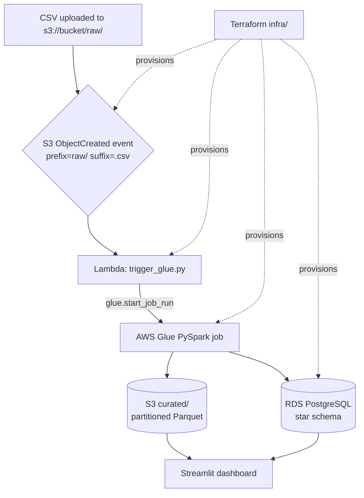

**Design note.** Provisioning is entirely declarative (Terraform). `boto3` appears
in exactly one place — inside the Lambda — where calling an AWS API at runtime is
the actual requirement. Infrastructure is never created imperatively from a script.

---

## 4. Code flow

### 4.1 Module map

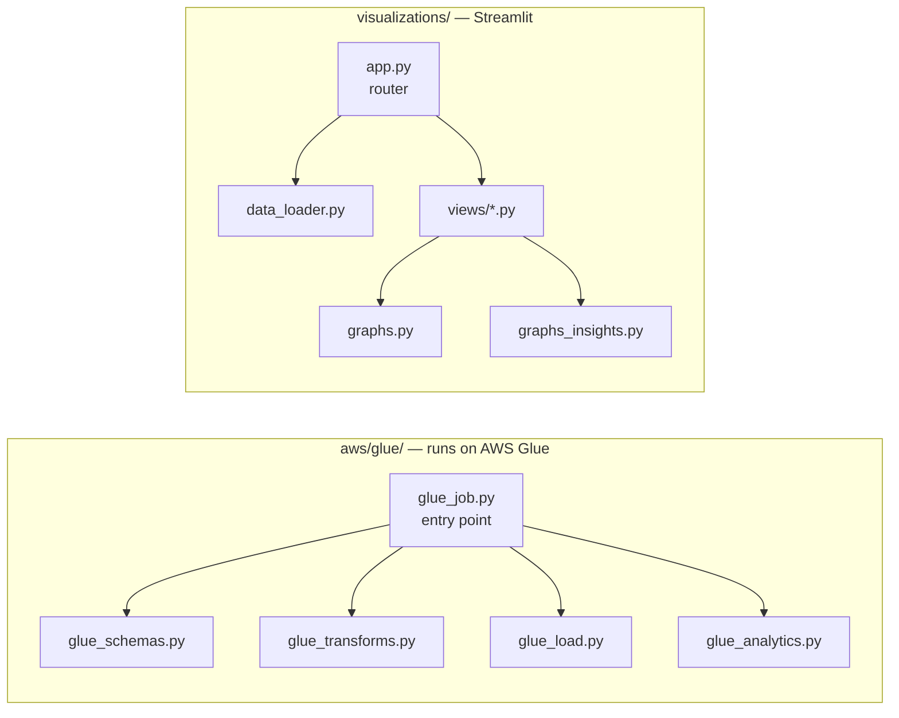

### 4.2 Execution order inside the Glue job

The entry point reads top-to-bottom as Extract → Transform → Load:

```python
# aws/glue/glue_job.py

    # Extract
    raw = {
        name: spark.read.csv(f"{raw_prefix}/{filename}", header=True, schema=schema())
        for name, (filename, schema) in RAW_FILES.items()
    }

    # Transform
    ag_clean = glue_transforms.clean_agriculture(raw["agriculture"])
    imd_clean = glue_transforms.clean_imd(raw["imd"])
    noaa_clean = glue_transforms.clean_noaa(raw["noaa"])

    dim_farms, dim_weather_stations = glue_transforms.build_dimensions(ag_clean, imd_clean)
    matched_farms = glue_transforms.match_farms_to_stations(ag_clean, imd_clean, dim_weather_stations)

    tables = {
        "dim_farms": dim_farms,
        "dim_weather_stations": dim_weather_stations,
        "fact_crop_yield": glue_transforms.build_fact_crop_yield(matched_farms),
        "fact_weather_observations": glue_transforms.build_fact_weather_observations(imd_clean),
        "fact_global_climate_environment": noaa_clean,
    }

    # Load
    glue_load.write_curated_parquet(tables, curated_prefix)

    url, props = glue_load.jdbc_settings(args)
    glue_load.reset_tables(args)
    glue_load.load_star_schema(tables, url, props)

    summaries = glue_analytics.build_all(...)
    glue_analytics.load_all(summaries, url, props)
```

### 4.3 Why the ETL is split across five files

Glue executes **one** entry-point script. Splitting it means the other four modules
must be shipped separately, which Terraform handles by zipping them:

```hcl
# infra/main.tf
locals {
  glue_modules = ["glue_schemas.py", "glue_transforms.py", "glue_load.py", "glue_analytics.py"]
}

data "archive_file" "glue_modules" {
  type        = "zip"
  output_path = "${path.module}/../aws/glue/glue_modules.zip"

  dynamic "source" {
    for_each = local.glue_modules
    content {
      content  = file("${path.module}/../aws/glue/${source.value}")
      filename = source.value
    }
  }
}
```

```hcl
# infra/glue.tf — the zip is handed to Glue here
default_arguments = {
  "--extra-py-files"            = "s3://${aws_s3_bucket.data_lake.id}/${aws_s3_object.glue_modules.key}"
  "--additional-python-modules" = "psycopg2-binary"
}
```

> **Maintenance warning.** Adding a new module under `aws/glue/` requires adding its
> filename to `local.glue_modules`. Forgetting this fails at runtime with
> `ModuleNotFoundError`, not at `terraform apply`.

---

## 5. Interfaces and contracts

This project exposes **no HTTP API** — it is a batch data pipeline, so there are no
REST routes. The equivalent integration points are the four contracts below.

### 5.1 S3 event → Lambda

Configured in `infra/lambda.tf`. Only `.csv` files under `raw/` fire the trigger,
which prevents the job from re-triggering on its own Parquet output:

```hcl
resource "aws_s3_bucket_notification" "csv_upload" {
  bucket = aws_s3_bucket.data_lake.id

  lambda_function {
    lambda_function_arn = aws_lambda_function.trigger_glue.arn
    events              = ["s3:ObjectCreated:*"]
    filter_prefix       = "raw/"
    filter_suffix       = ".csv"
  }

  depends_on = [aws_lambda_permission.allow_s3]
}
```

### 5.2 Lambda handler

```python
# aws/lambda/trigger_glue.py
def lambda_handler(event, context):
    record = event["Records"][0]
    bucket = record["s3"]["bucket"]["name"]
    key = record["s3"]["object"]["key"]

    print(f"S3 event: s3://{bucket}/{key}")

    try:
        response = glue.start_job_run(
            JobName=GLUE_JOB_NAME,
            Arguments={
                "--S3_BUCKET_NAME": S3_BUCKET_NAME,
                "--RDS_HOST": RDS_HOST,
                "--RDS_PORT": RDS_PORT,
                "--RDS_DB": RDS_DB,
                "--RDS_USER": RDS_USER,
                "--RDS_PASSWORD": RDS_PASSWORD,
            },
        )
        return {"statusCode": 200,
                "body": json.dumps({"message": "Glue job started",
                                    "job_run_id": response["JobRunId"]})}
    except Exception as e:
        return {"statusCode": 500, "body": json.dumps({"error": str(e)})}
```

**Response contract**

| Status | Body |
|---|---|
| `200` | `{"message", "file", "job_run_id"}` |
| `500` | `{"error"}` |

### 5.3 Glue job arguments

Seven arguments, all required. Missing any one aborts the run with `GlueArgumentError`:

| Argument | Source |
|---|---|
| `--JOB_NAME` | supplied by Glue |
| `--S3_BUCKET_NAME` | Terraform output `bucket_name` |
| `--RDS_HOST` | Terraform output `db_endpoint` (host portion) |
| `--RDS_PORT` | `5432` |
| `--RDS_DB` | `agri_climate` |
| `--RDS_USER` | `dbadmin` |
| `--RDS_PASSWORD` | Terraform output `db_password` (sensitive) |

### 5.4 Output targets

| Target | Location | Partitioned by |
|---|---|---|
| `dim_farms` | `s3://bucket/curated/dim_farms` | — |
| `dim_weather_stations` | `s3://bucket/curated/dim_weather_stations` | — |
| `fact_crop_yield` | `s3://bucket/curated/fact_crop_yield` | `season` |
| `fact_weather_observations` | `s3://bucket/curated/fact_weather_observations` | `season` |
| `fact_global_climate_environment` | `s3://bucket/curated/…` | `country` |

All eight tables are additionally written to RDS over JDBC.

### 5.5 Dashboard navigation

The dashboard's "routes" are a sidebar radio mapped to view modules:

```python
# visualizations/app.py
PAGES = {
    "Platform Overview": overview,
    "Use Case 1: Yield & Weather": usecase1_yield_weather,
    "Use Case 2: Climate Risk": usecase2_climate_risk,
    "Use Case 3: NOAA Environment": usecase3_noaa_environment,
    "Hidden Insights": hidden_insights,
}

PAGES[page].render(dfs)
```

> The directory is named `views/`, not `pages/`. Streamlit treats a `pages/` folder
> beside the entry point as automatic multi-page navigation, which would have
> conflicted with this manual router.

---

## 6. Data model

### 6.1 Star schema

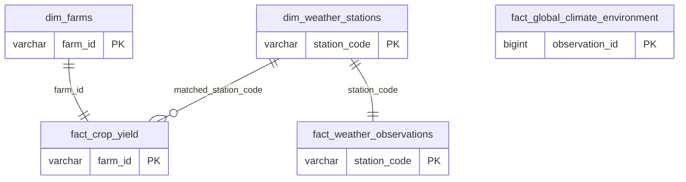

| Table | Rows | Columns |
|---|---|---|
| `dim_farms` | 2,000 | 10 |
| `dim_weather_stations` | 2,000 | 4 |
| `fact_crop_yield` | 2,000 | 25 |
| `fact_weather_observations` | 2,000 | 21 |
| `fact_global_climate_environment` | 2,000 | 31 |
| `analytics.yield_weather_correlation` | rollup | 6 |
| `analytics.climate_risk_farms` | rollup | 7 |
| `analytics.global_environment_summary` | rollup | 7 |

### 6.2 Farm-to-station matching

Farms and stations share no key. Two strategies, in order:

```python
# aws/glue/glue_transforms.py
def match_farms_to_stations(ag_clean, imd_clean, dim_weather_stations):
    keep_cols = ag_clean.columns + ["matched_station_code", "match_type"]

    exact_raw = (
        ag_clean.join(dim_weather_stations, on=["state", "district"], how="inner")
        .withColumn("matched_station_code", col("station_code"))
        .withColumn("match_type", lit("Exact District Match"))
    )
    # A district can hold several stations, which would fan one farm out into
    # several rows and collide with fact_crop_yield's farm_id primary key.
    exact_matches = (
        exact_raw
        .withColumn("_rn", row_number().over(Window.partitionBy("farm_id").orderBy("station_code")))
        .filter(col("_rn") == 1)
        .select(*keep_cols)
    )

    unmatched = ag_clean.join(dim_weather_stations, on=["state", "district"], how="left_anti")

    # Project to just the join keys: carrying all of imd_clean here would
    # duplicate column names (season, rainfall_mm...) and make later
    # references ambiguous.
    station_readings = imd_clean.select("station_code", "state", "observation_date")
    fallback = (
        unmatched.join(station_readings, on="state", how="inner")
        .withColumn("date_diff", spark_abs(datediff(col("sowing_date"), col("observation_date"))))
        .withColumn("_rn", row_number().over(
            Window.partitionBy("farm_id").orderBy("date_diff", "station_code")
        ))
        .filter(col("_rn") == 1)
        .withColumn("matched_station_code", col("station_code"))
        .withColumn("match_type", lit("Nearest In State"))
        .select(*keep_cols)
    )

    return exact_matches.unionByName(fallback)
```

**Result**

| Match type | Farms | Share |
|---|---|---|
| Exact District Match | 1,739 | 87.0% |
| Nearest In State | 261 | 13.0% |
| **Total** | **2,000** | **100%** |

182 distinct stations are actually used out of 2,000 available.

### 6.3 Loading strategy

Spark's `mode="overwrite"` issues `DROP TABLE`. That fails against foreign keys and
would replace the DDL's `DECIMAL` types with Spark's inferred ones. Instead:

```python
# aws/glue/glue_load.py
RESET_SQL = """
    TRUNCATE TABLE
        fact_crop_yield, fact_weather_observations, fact_global_climate_environment,
        dim_farms, dim_weather_stations,
        analytics.yield_weather_correlation, analytics.climate_risk_farms,
        analytics.global_environment_summary
    RESTART IDENTITY CASCADE;
"""


def load_star_schema(tables, url, props):
    """Load dimensions before facts so the foreign keys resolve."""
    print("Loading Dimension Tables to RDS...")
    for name in ("dim_farms", "dim_weather_stations"):
        tables[name].write.jdbc(url=url, table=name, mode="append", properties=props)

    print("Loading Fact Tables to RDS...")
    for name in ("fact_crop_yield", "fact_weather_observations", "fact_global_climate_environment"):
        tables[name].write.jdbc(url=url, table=name, mode="append", properties=props)
```

Postgres only permits truncating an FK-referenced table if its dependents are
truncated in the **same** statement — hence one command for all eight tables.

---

## 7. Use cases, code and results

### 7.1 Reading these results honestly

The source data is synthetic. Some specified charts plot variables that are
statistically independent, and the documentation says so rather than inventing a
narrative. Each such chart is paired with a companion chart built on a relationship
that does hold.

---

### Use Case 1 — Yield vs. official weather

**Question.** Does the weather recorded at official stations explain farm profitability?

#### Chart 1.1 — Profitability vs. station rainfall

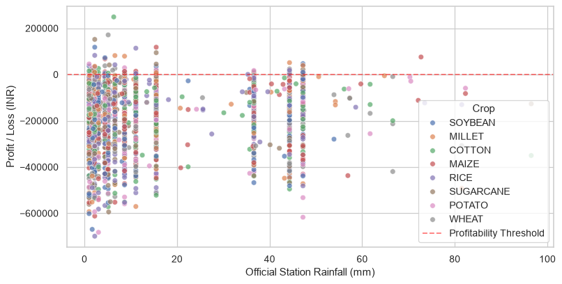

Flat cloud, no left-to-right slope, nearly all of it below break-even.
**r = +0.048** — station rainfall does not separate profitable farms from unprofitable ones.

#### Chart 1.2 — Rainfall reporting gap by state

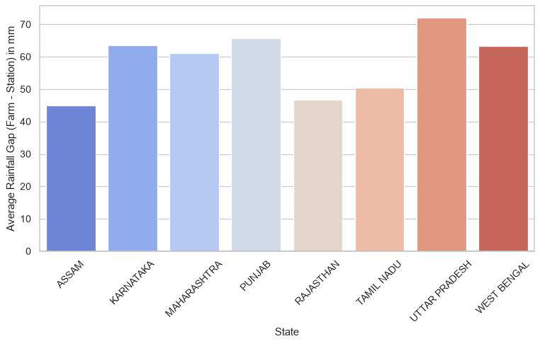

The measurable disagreement between farmer-reported and official rainfall. This is
the genuinely useful output of the join: it quantifies data-quality drift, which
matters for insurance claims assessed on self-reported weather.

#### Chart 1.3 — Profit driver explorer (interactive)

```python
# visualizations/views/usecase1_yield_weather.py
PROFIT_DRIVERS = {
    "Official Station Rainfall (mm)": "rainfall_mm",
    "Production Cost (INR)": "production_cost_inr",
    "Land Area (acres)": "land_area_acres",
}


def _render_profit_explorer(merged):
    st.write("#### 3. Profit Driver Explorer (interactive)")

    all_crops = sorted(merged["crop"].unique())
    col_a, col_b = st.columns([1, 1])
    with col_a:
        crops = st.multiselect("Crops to compare", all_crops, default=all_crops[:4])
    with col_b:
        driver = st.radio("Compare profit against", list(PROFIT_DRIVERS), index=0)

    fig = graphs_insights.plot_profit_trend(merged, PROFIT_DRIVERS[driver], driver, crops)
    st.pyplot(fig)
```

The chart binds x-axis to a selector so the user discovers the answer by comparison:

| Selector = Rainfall | Selector = Production Cost |
|---|---|
| 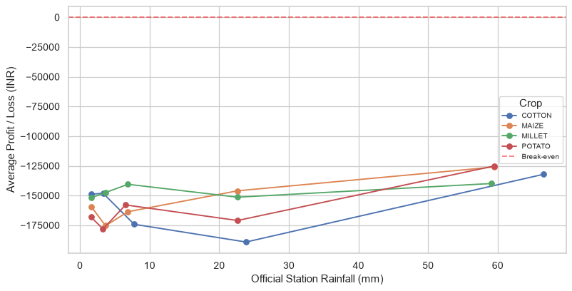 | 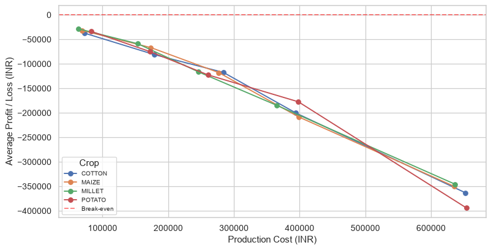 |
| Tangled, flat — no signal | Clean monotonic decline — strong signal |

Quantile bins are used rather than equal-width so each point rests on a similar
number of farms:

```python
# visualizations/graphs_insights.py
def plot_profit_trend(merged_df, x_col, x_label, crops):
    """Mean profit across quantile bins of x_col, one line per selected crop."""
    fig, ax = plt.subplots(figsize=(10, 5))

    for crop in crops:
        sub = merged_df[merged_df["crop"] == crop]
        if sub.empty:
            continue
        # Quantile bins keep each point backed by a similar number of farms,
        # so a line never swings wildly on the strength of one outlier.
        binned = pd.qcut(sub[x_col], q=5, duplicates="drop")
        summary = sub.groupby(binned, observed=True)["profit_loss_inr"].mean()
        ax.plot([b.mid for b in summary.index], summary.values, marker="o", label=crop)

    ax.axhline(0, color="red", linestyle="--", alpha=0.5, label="Break-even")
    return fig
```

**Finding.** `profit_loss_inr` equals `market_price_inr − production_cost_inr`
**exactly** (max residual `1.16e-10`). Production cost correlates with profit at
**r = −0.887**; station rainfall at **r = +0.048**. Cost runs roughly twice revenue
throughout, which is why 95.4% of farms show a loss and the median margin is −114%.
Profitability here is a cost-structure story, not a climate one.

---

### Use Case 2 — Climate risk and farm resilience

**Question.** Do official weather alerts predict crop damage?

#### Chart 2.1 — State × crop health

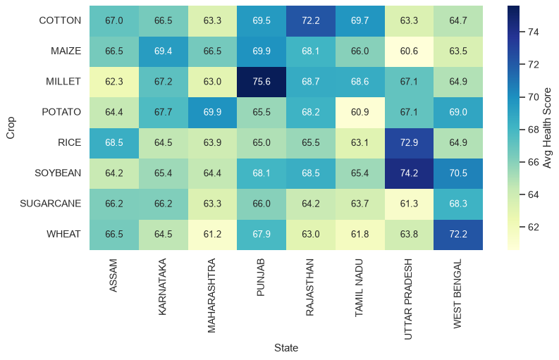

Scores cluster in the 60s–70s; no state-crop pairing stands out dramatically.

#### Chart 2.2 — Pest rate under alert vs. no alert *(specified chart)*

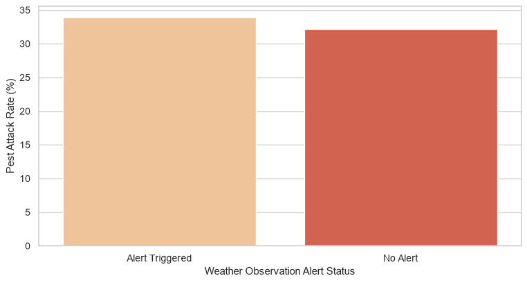

**33.9% vs 32.2%** — a 1.7-point difference. Flood and cyclone alerts do **not**
predict pest attacks. Weather alerts are not a usable early-warning signal here.

#### Chart 2.3 — What a pest attack actually costs *(companion chart)*

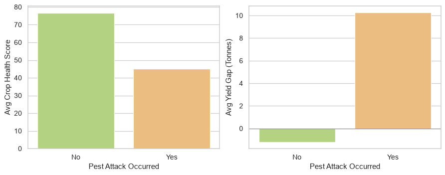

```python
# visualizations/views/usecase2_climate_risk.py
pest_summary = (
    yield_df.groupby("pest_attack")[["crop_health_score", "yield_gap_tonnes"]].mean().reset_index()
)
fig = graphs_insights.plot_pest_impact(pest_summary)
st.pyplot(fig)
```

| Metric | No pest | Pest attack | Change |
|---|---|---|---|
| Crop health score | 76.66 | 45.10 | **−31.6 points** |
| Yield gap (tonnes) | −1.21 | +10.26 | **11.5 t swing** |
| Actual yield (tonnes) | 50.63 | 41.05 | **−19%** |

**Finding.** Pests are the single largest driver of lost yield (`crop_health_score`
vs `yield_gap_tonnes`, **r = −0.616**) — but weather alerts give no warning of them.
Resource pre-positioning should therefore be driven by pest surveillance, not
meteorological alerts.

---

### Use Case 3 — Global environmental monitoring

**Question.** What drives air quality and disaster risk?

#### Chart 3.1 — AQI by country *(specified chart)*

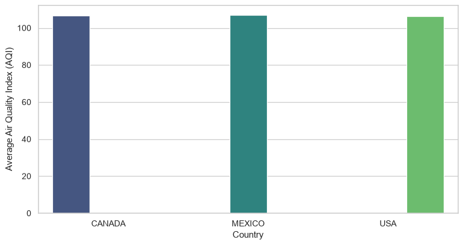

Canada 106.7 · Mexico 107.0 · USA 106.2 — within one point. Country carries no
information about air quality in this dataset.

#### Chart 3.2 — Climate zone × disaster risk *(specified chart)*

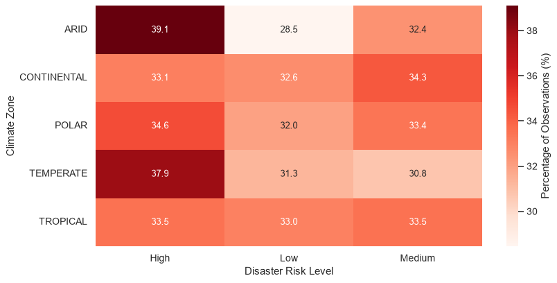

Every cell near 33%. Climate zone carries no information about disaster risk.

#### Chart 3.3 — Environmental correlation matrix *(companion chart)*

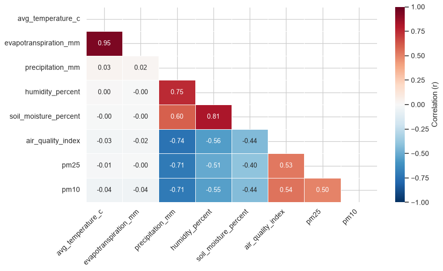

```python
# visualizations/graphs_insights.py
def plot_env_correlation_heatmap(noaa_df):
    """Correlation matrix of the NOAA environmental measures."""
    cols = [
        "avg_temperature_c", "evapotranspiration_mm", "precipitation_mm",
        "humidity_percent", "soil_moisture_percent", "air_quality_index", "pm25", "pm10",
    ]
    corr = noaa_df[cols].corr()

    fig, ax = plt.subplots(figsize=(10, 6))
    sns.heatmap(
        corr,
        mask=np.triu(np.ones_like(corr, dtype=bool)),  # upper half mirrors the lower, so hide it
        annot=True, fmt=".2f", cmap="RdBu_r", center=0, vmin=-1, vmax=1,
        linewidths=0.5, cbar_kws={"label": "Correlation (r)"}, ax=ax,
    )
    return fig
```

Same chart type as 3.2, real structure. Two clusters emerge: a thermal one
(temperature → evapotranspiration, **+0.945**) and a hydrological one
(precipitation → humidity → soil moisture, and precipitation → AQI at **−0.741**).

#### Chart 3.4 — Drought index profile *(companion chart)*

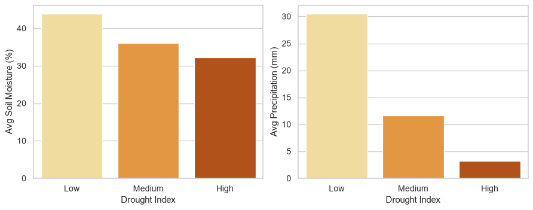

| Drought index | Soil moisture | Precipitation |
|---|---|---|
| Low | 43.93% | 30.54 mm |
| Medium | 36.03% | 11.65 mm |
| High | 32.29% | 3.26 mm |

**Finding.** Unlike climate zone, the drought index is a genuine summary of local
water availability — both measures fall monotonically as severity rises.

---

### Hidden Insights

#### Evapotranspiration vs. temperature

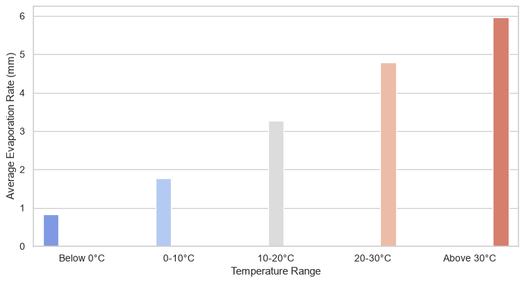

0.8 mm below 0 °C rising to 6.0 mm above 30 °C — roughly sevenfold (**r = +0.945**).
A direct visual for water stress: higher temperatures mean faster soil drying.

#### Actual vs. expected yield

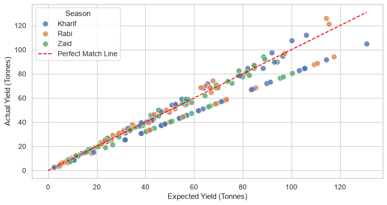

**r = +0.972.** Farms forecast well; points below the red line are the shortfalls,
averaging about 5% of expected yield.

#### AQI vs. precipitation

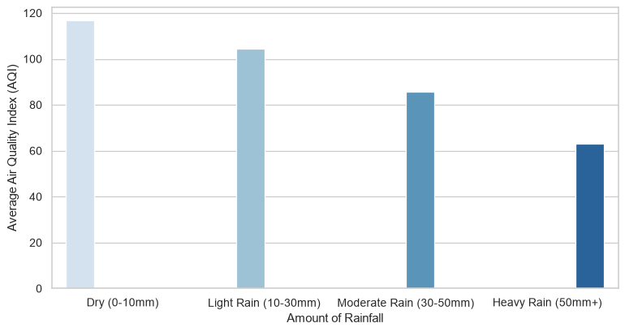

**r = −0.741.** Rain scrubs particulates from the air. This is the effect the flat
AQI-by-country chart was missing.

---

## 8. Running the project

### 8.1 Locally

```bash
python pyspark/run_pipeline.py     # raw CSVs -> datasets/curated/ Parquet
python testing/verify_tests.py     # writes testing/test_results_log.csv
streamlit run visualizations/app.py
```

### 8.2 Deploying to AWS

```bash
cd infra
terraform init
terraform apply
```

Create the tables once (reads `DB_HOST` and `DB_PASSWORD` from the environment):

```bash
python apply_schema.py
```

From here the pipeline is event-driven:

```bash
aws s3 cp ../datasets/raw/agriculture_crop_analysis.csv s3://<bucket>/raw/
```

To start a run directly instead:

```powershell
.\test_glue_args.ps1
```

> **PowerShell note.** `ConvertTo-Json | Set-Content -Encoding utf8` writes a UTF-8
> BOM in PowerShell 5.1, which the AWS CLI rejects when reading `file://`. The helper
> script uses `[System.IO.File]::WriteAllText` with `UTF8Encoding($false)` instead.

### 8.3 Deployed dashboard

Hosted on Streamlit Community Cloud from `visualizations/app.py`, reading the
committed Parquet files. The live-RDS option is intentionally unused there —
connecting would require typing a database password into a public page.

---

## 9. Verification

The pipeline was validated at four levels:

| Level | Check | Result |
|---|---|---|
| Schema | Fact column lists vs `create_tables.sql` | 25 and 21 columns, exact match |
| Referential | `matched_station_code` values absent from `dim_weather_stations` | **0 orphans** |
| Key integrity | Duplicate PKs in each fact table | none |
| Runtime | Glue job end-to-end on AWS | succeeded |
| Dashboard | All 5 pages, 13 charts | 0 exceptions |
| Dependencies | Every import present in `requirements.txt` | all covered |

### 9.1 Bugs found and fixed during development

| Symptom | Root cause | Fix |
|---|---|---|
| `Reference 'season' is ambiguous` | Fallback join carried all of `imd_clean`, duplicating column names | Project to the three join keys only |
| `cannot drop table dim_farms` | Spark `mode="overwrite"` issues `DROP TABLE`, blocked by FKs | `TRUNCATE … CASCADE` + `mode="append"` |
| `Column "state" not found` | Facts carried dimension columns; `append` validates against the real table | Explicit `.select()` to the DDL columns |
| `duplicate key … fact_crop_yield_pkey` | A district holds several stations, fanning one farm into several rows | Window dedup to one station per farm |
| Overview showed 2,000 "stations matched" | Metric counted the dimension, not actual matches | Count `matched_station_code` distinct → 182 |
| 5 charts would break on seaborn 0.14 | `palette=` without `hue=` is deprecated | Added `hue=` + `legend=False` |

The `mode="overwrite"` bug is worth dwelling on: it was silently *masking* the
schema error. Overwrite recreated each table to match whatever the DataFrame held,
so the extra dimension columns never raised anything — they just quietly corrupted
the star schema. Switching to `append` made Spark validate against the real table
and surface the mismatch.

---

## 10. Cost and teardown

| Service | Billing | Notes |
|---|---|---|
| RDS `db.t3.micro` | **hourly** | free tier 12 months; the only continuous cost |
| S3 | per GB | ~2 MB stored — negligible |
| Glue | per DPU-hour | 2 × G.1X, a few minutes per run |
| Lambda | per invocation | free tier covers it |

RDS is the only meaningful cost. When finished:

```bash
cd infra
terraform destroy
```

### Security note

The RDS instance is deliberately `publicly_accessible = true` with ingress from
`0.0.0.0/0`, so the dashboard can reach it from a laptop without a bastion host or
VPN. It is protected only by a generated 20-character password.

**This is a demo convenience, not a pattern to copy.** Production would place RDS in
a private subnet and reach it through a bastion, a VPN, or a VPC-attached Lambda.
The Terraform state holding that password is excluded from version control.
